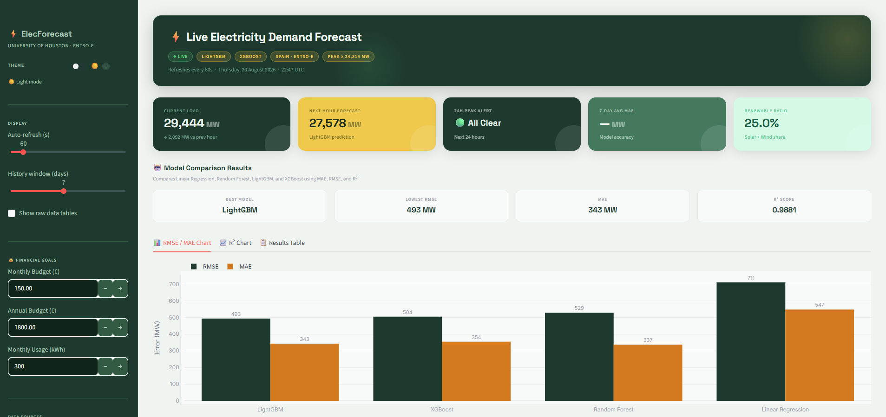
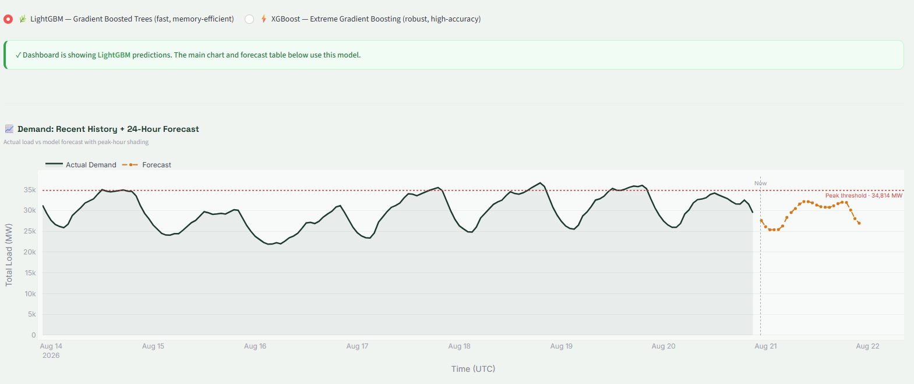
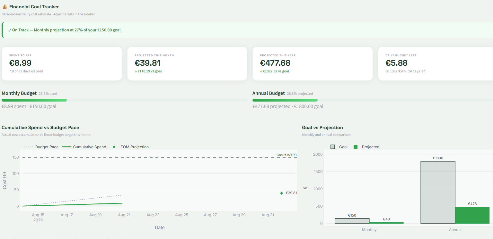
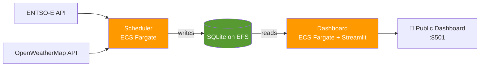

# ⚡ Electricity Demand Forecasting

An end-to-end pipeline that forecasts electricity demand using real-time grid and weather data, deployed as a containerized service on AWS.

---

## 📖 Overview

This project pulls live electricity demand data from **ENTSO-E** and weather data from **OpenWeatherMap**, trains a forecasting model, and serves the results through an interactive **Streamlit dashboard** — all running on a serverless AWS architecture.

> 🔗 **Live demo:** [http://100.62.91.110:8501](http://100.62.91.110:8501)
> *(Scaled to zero when not in active use to control cost — open an issue or reach out if the link is down and I'll spin it back up.)*

---

## 📸 Screenshots

| Dashboard Overview | Forecast vs. Actual | Model Comparison |
|:---:|:---:|:---:|
|  |  |  |

---

## 🏗️ Architecture

| Layer | Technology |
|---|---|
| **Data sources** | ENTSO-E (grid demand), OpenWeatherMap (weather) |
| **Compute** | AWS ECS on Fargate (serverless containers) — `scheduler` + `dashboard` services |
| **Storage** | AWS EFS (persistent, shared SQLite database) |
| **Secrets** | AWS Secrets Manager |
| **Access control** | Scoped IAM roles, VPC security groups |
| **Frontend** | Streamlit |
| **Containerization** | Docker, pushed to AWS ECR |

---

## ✨ Features

- 🔄 Automated data collection from live grid and weather APIs
- 📊 Interactive Streamlit dashboard for exploring forecasts
- 📦 Fully containerized — reproducible builds via Docker
- ☁️ Serverless deployment — no EC2 instances to manage
- 🔐 Secrets never hardcoded — pulled at runtime from AWS Secrets Manager
- 💾 Persistent storage across container restarts via EFS

---

## 🚀 Getting Started

- **Prerequisites**: Docker, AWS CLI configured with appropriate credentials, and API keys for ENTSO-E and OpenWeatherMap
- **Local run**: clone the repo, install dependencies from `requirements.txt`, set your API keys as environment variables, then run the training script followed by the Streamlit dashboard
- **Refreshing data**: the scheduler task can be triggered manually via an ECS `run-task` command against the `electricity-demand-forecasting-scheduler` task definition

---

## 🛠️ Tech Stack

`Python` · `Streamlit` · `Docker` · `AWS ECS/Fargate` · `AWS ECR` · `AWS EFS` · `AWS Secrets Manager` · `AWS IAM`

---

## 📄 License

MIT
